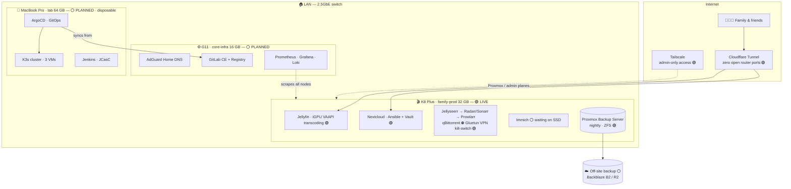

<div align="center">

# 🏠 homelab-infra

**A 3-node Proxmox homelab, rebuilt from git in under 30 minutes.**

*Family media platform + Kubernetes DevOps playground — everything as code.*

[](https://www.proxmox.com/)
[](https://www.terraform.io/)
[](https://www.ansible.com/)
[](https://docs.docker.com/compose/)
[](https://k3s.io/)
[-EF7B4D?logo=argo&logoColor=white)](https://argoproj.github.io/cd/)

[Architecture](#%EF%B8%8F-architecture) · [Hardware](#-hardware) · [Stack](#-stack) · [Rebuild from zero](#-rebuild-from-zero) · [Design decisions](#-design-decisions) · [Roadmap](#-roadmap)

**Build status:** 🟢 live · 🟡 in progress · ⚪ planned — this is a real build-in-public, so the repo reflects exactly what's running today.

</div>

---

## Why this exists

Two problems, one cluster:

1. **My family needed a private cloud** — movies and shows on demand, phone photo backup, and file storage, without handing everything to Big Tech.
2. **I needed a production-grade DevOps lab** — a place to practise Kubernetes, GitOps, CI/CD, and infrastructure-as-code the way real teams run them, not in throwaway tutorials.

The twist that makes this interesting: **the two tiers have opposite reliability requirements.** The family tier must never go down; the lab tier is *designed* to be destroyed. So the lab node gets torn down and rebuilt from this repo — on purpose, monthly, timed. If it isn't in git, it doesn't exist.

> 🎥 **Demo video** — one `git push` travels through CI, security scanning, and ArgoCD to a live Kubernetes rollout. *(planned for the lab-tier phase)*

## 🏗️ Architecture

🟢 live today · ⚪ planned. Only the K8 Plus node is built so far — the family tier is fully running on it. The G11 and MacBook nodes are the next hardware phases.



**Traffic flow (live):** everything public enters through a Cloudflare Tunnel (no open router ports); only Jellyfin and Nextcloud are exposed. Every admin plane — Proxmox, and later Grafana/Jenkins/GitLab — is reachable over **Tailscale only** (subnet router), never publicly. The torrent client has **zero network unless the VPN tunnel is healthy** (Gluetun kill-switch).

## 🖥️ Hardware

| Node | Machine | Specs | Role | Status |
|---|---|---|---|---|
| `family-prod` | GMKtec K8 Plus | Ryzen 8845HS · 32 GB · 512 GB NVMe + 2×1 TB HDD | Media, photos, files, backups | 🟢 Live |
| `core-infra` | GMKtec G11 | 16 GB · 256 GB SSD | Proxy, DNS, GitLab, monitoring | ⚪ Planned |
| `lab` | MacBook Pro 2019 | i9 · 64 GB · 1 TB SSD | K3s, CI/CD, experiments | ⚪ Planned · deliberately disposable |

## 🧰 Stack

| Layer | Tools | Status |
|---|---|---|
| Virtualisation | Proxmox VE 9 (ZFS) · 3-node cluster once G11 + MacBook join | 🟢 1 node live |
| Provisioning | Terraform (`bpg/proxmox`) + cloud-init templates | 🟢 Live |
| Configuration | Ansible — bootstrap + `site.yml` roles, reusable `compose_stack` role | 🟢 Live |
| Containers | Docker Compose (family tier) · K3s + Helm (lab tier) | 🟢 Compose live · ⚪ K3s planned |
| Secrets | **Ansible Vault** — encrypted vars, safe to commit; pre-commit secret scanner | 🟢 Live |
| Edge & access | Cloudflare Tunnel (no open ports) · Tailscale subnet router (admin-only) | 🟢 Live |
| VPN kill-switch | Gluetun (Windscribe WireGuard) — qBittorrent has no net if the tunnel drops | 🟢 Live |
| Backups | Proxmox Backup Server → nightly (ZFS) · off-site (B2/R2) once photos land | 🟢 Local · ⚪ off-site |
| GitOps | ArgoCD app-of-apps — `kubectl apply` is for debugging only | ⚪ Planned (lab tier) |
| CI/CD | GitLab CI + Jenkins (Configuration-as-Code) · Trivy image scanning | ⚪ Planned |
| Observability | Prometheus · Grafana (provisioned as code) · Loki · node_exporter on every host | 🟡 exporters live · dashboards next |

## 📁 Repository layout

```
.
├── ansible/          # Post-install playbook + roles (network, firewall, docker, exporters, tailscale…)
├── terraform/        # VMs, LXCs, K3s cluster — the whole lab as code
├── compose/          # Family-tier stacks (media, photos, files) — one dir per stack
├── kubernetes/       # Helm values + ArgoCD Applications (app-of-apps)
├── pipelines/        # Jenkinsfiles, JCasC yaml, GitLab CI templates
├── scripts/          # Runnable documentation (storage setup, NIC fix…)
└── docs/
    ├── adr/          # Architecture Decision Records — the "why" behind everything
    └── runbooks/     # Install logs, restore drills, decommission checklists
```

## 🔄 Rebuild from zero

The lab node is rebuilt from scratch every month as a disaster-recovery drill:

```bash
terraform destroy && terraform apply   # VMs return
ansible-playbook site.yml              # nodes configured
# ArgoCD reinstalls itself, then pulls every app back from git
```

| Drill | Time | What broke |
|---|---|---|
| #1 | *(pending)* | — |

*(This table fills in as drills happen — the times should trend down and the breakage column toward "nothing".)*

## 🧠 Design decisions

The interesting choices live in [`docs/adr/`](docs/adr/). Highlights:

- **[ADR-001](docs/adr/001-cluster-topology.md)** — Why 3 nodes, why no HA/auto-failover, and how quorum survives losing the lab node
- **[ADR-002](docs/adr/002-flaky-hardware-placement.md)** — The lab runs on a MacBook whose NIC dies on reboot. That's a feature: only disposable workloads live there, and a systemd unit self-heals the NIC
- **[ADR-003](docs/adr/003-attack-surface.md)** — Public surface reduced to user-facing apps only; every admin plane moved behind zero-trust access
- **[ADR-004](docs/adr/004-git-bootstrap.md)** — Why this repo lives on GitHub even though GitLab is self-hosted: never let infrastructure code depend on the infrastructure it describes

## 📈 Observability

Every node exports metrics; every container ships logs. One Grafana instance sees everything.

<!-- Screenshots: Grafana cluster dashboard · ArgoCD app tree · Jellyfin library -->
*(screenshots coming after Phase 2)*

## 🗺️ Roadmap

- [x] **Phase 0** — Repo bootstrapped · Proxmox on ZFS · Terraform + Ansible pipeline working · PBS nightly backups
- [x] **Phase 1** — Family tier live on K8 Plus: Jellyfin (iGPU transcoding), Nextcloud (Ansible+Vault), media automation with VPN kill-switch — zero-downtime cutover from the old MacBook. *(Immich pending the SSD)*
- [ ] **Phase 2** — Core infra on G11 (proxy, DNS, GitLab, centralized monitoring, 3-2-1 off-site backups, edge lockdown)
- [ ] **Phase 3** — Lab rebuilt from code (K3s via Terraform/Ansible, ArgoCD, JCasC Jenkins, first commit-to-deploy pipeline)
- [ ] **Phase 4** — Monthly teardown drills · CKA
- [ ] **Phase 5** — Ephemeral cloud twin: `terraform apply` the lab onto AWS for live demos, `destroy` when done (see [terraform/aws-demo](terraform/aws-demo/))
- [ ] **Phase 6** — Portfolio showcase on [jocelynchoo.com](https://jocelynchoo.com) — demo video, live dashboards, this repo

## ✍️ Write-ups

- *Migrating my family's media platform to a 3-node Proxmox cluster — with zero downtime* (coming soon)
- *GitOps-ing my homelab with ArgoCD* (coming soon)
- *What rebuilding my lab from scratch taught me about IaC* (coming soon)

## 👋 About

I'm **Jocelyn** — building this in public while transitioning into DevOps engineering (Hong Kong).
Everything here is reproducible: clone it, read the ADRs, steal the playbooks.

[](https://www.linkedin.com/in/jocelynchoo65/)
[](mailto:misteroni@jchoo.me)

---

<div align="center">
<sub>⚡ Powered by three small computers and an unreasonable love of automation.</sub>
</div>
