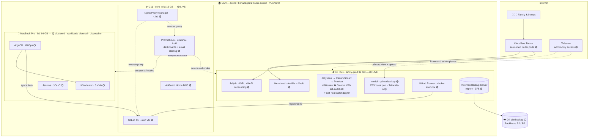
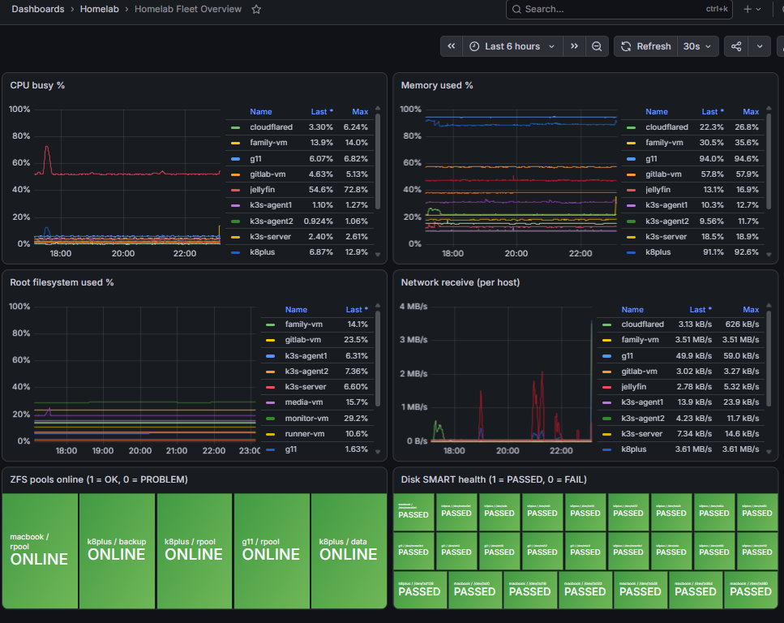

<div align="center">

# 🏠 homelab-infra

**A 3-node Proxmox homelab, rebuilt from git in under 30 minutes.**

*Family media platform + Kubernetes DevOps playground — everything as code.*

[](https://www.proxmox.com/)
[](https://www.terraform.io/)
[](https://www.ansible.com/)
[](https://docs.docker.com/compose/)
[](https://docs.gitlab.com/runner/)
[](https://k3s.io/)
[-EF7B4D?logo=argo&logoColor=white)](https://argoproj.github.io/cd/)

[Architecture](#%EF%B8%8F-architecture) · [Hardware](#-hardware) · [Stack](#-stack) · [Rebuild from zero](#-rebuild-from-zero) · [Design decisions](#-design-decisions) · [Roadmap](#-roadmap)

**Build status:** 🟢 live · 🟡 in progress · ⚪ planned — this is a real build-in-public, so the repo reflects exactly what's running today.

</div>

---

## Why this exists

Two problems, one cluster:

1. **My family needed a private cloud** — movies and shows on demand, phone photo backup, and file storage, without handing everything to Big Tech.
2. **I needed a production-grade DevOps lab** — a place to practise Kubernetes, GitOps, CI/CD, and infrastructure-as-code the way real teams run them, not in throwaway tutorials.

The twist that makes this interesting: **the two tiers have opposite reliability requirements.** The family tier must never go down; the lab tier is *designed* to be destroyed. So the lab node gets torn down and rebuilt from this repo — on purpose, monthly, timed. If it isn't in git, it doesn't exist.

> 🎥 **Demo video** — one `git push` travels through CI, security scanning, and ArgoCD to a live Kubernetes rollout. *(planned for the lab-tier phase)*

## 🏗️ Architecture

🟢 live today · 🟡 in progress · ⚪ planned. **All three nodes are now clustered.** The family tier (K8 Plus — now including **Immich** photo backup on its own SSD-backed ZFS pool) and the core-infra tier (G11 — DNS, reverse proxy, monitoring, GitLab) are live. A **GitLab Runner** is registered and CI pipelines are the current phase. The MacBook lab node has joined the cluster; its K3s / GitOps workloads come next.


```mermaid
flowchart TB
    subgraph Internet
        U[👨‍👩‍👧 Family & friends]
        CF[Cloudflare Tunnel<br/>zero open router ports 🟢]
        TS[Tailscale<br/>admin-only access 🟢]
    end

    subgraph LAN["🏠 LAN — MikroTik managed 2.5GbE switch · VLANs 🟡"]
        subgraph K8["🎬 K8 Plus · family-prod 32 GB — 🟢 LIVE"]
            JF[Jellyfin · iGPU VAAPI transcoding 🟢]
            NC[Nextcloud · Ansible + Vault 🟢]
            ARR[Jellyseerr → Radarr/Sonarr → Prowlarr<br/>qBittorrent ⛔ Gluetun VPN kill-switch 🟢<br/>+ self-heal watchdog 🟢]
            IM[Immich · photo backup 🟢<br/>ZFS 'data' pool · Tailscale-only]
            RUN[GitLab Runner · docker executor 🟢]
            PBS[(Proxmox Backup Server<br/>nightly · ZFS 🟢)]
        end

        subgraph G11["⚙️ G11 · core-infra 16 GB — 🟢 LIVE"]
            DNS[AdGuard Home DNS 🟢]
            NPM["Nginx Proxy Manager · *.lab 🟢"]
            GL[GitLab CE · own VM 🟢]
            MON[Prometheus · Grafana · Loki<br/>dashboards + email alerting 🟢]
        end

        subgraph MBP["🧪 MacBook Pro · lab 64 GB — 🟡 clustered · workloads planned · disposable"]
            K3S[K3s cluster · 3 VMs ⚪]
            CD[ArgoCD · GitOps ⚪]
            JK[Jenkins · JCasC ⚪]
        end
    end

    B2[(☁️ Off-site backup ⚪<br/>Backblaze B2 / R2)]

    U --> CF --> JF & NC
    TS -. Proxmox / admin planes .-> K8
    TS -. photos: view + upload .-> IM
    NPM -. reverse proxy .-> MON & GL
    RUN -- registered to --> GL
    CD -- syncs from --> GL
    CD --> K3S
    MON -. scrapes all nodes .-> K8 & G11 & MBP
    PBS --> B2
```

**Traffic flow (live):** everything public enters through a Cloudflare Tunnel (no open router ports); only Jellyfin and Nextcloud are exposed. Every admin plane — Proxmox, Grafana, GitLab — is reachable over **Tailscale only**, never publicly. **Immich is Tailscale-only by design**: family photos are more sensitive than the media catalogue, and it also sidesteps Cloudflare's 100 MB request-body cap that broke large video uploads. Internal services are reached by name via **AdGuard DNS rewrites → Nginx Proxy Manager (`*.lab`)**, and remotely via **Tailscale split-DNS**. The torrent client has **zero network unless the VPN tunnel is healthy** (Gluetun kill-switch), with a systemd watchdog that restarts the stack if DHT collapses. A MikroTik managed switch is in place with VLAN segmentation in progress.

## 🖥️ Hardware

| Node | Machine | Specs | Role | Status |
|---|---|---|---|---|
| `family-prod` | GMKtec K8 Plus | Ryzen 8845HS · 32 GB · 512 GB NVMe + **1 TB NVMe (photos)** + 2×2.5 GbE | Media, photos, files, backups, CI runner | 🟢 Live |
| `core-infra` | GMKtec G11 | 16 GB · 256 GB SSD | Proxy, DNS, GitLab, monitoring | 🟢 Live |
| `lab` | MacBook Pro 2019 | i9 · 64 GB · 1 TB SSD · 2×2.5 GbE USB-C | K3s, CI/CD, experiments | 🟡 Clustered · K3s planned · deliberately disposable |

**Storage layout (ZFS everywhere):**

| Pool | Media | Purpose | Redundancy |
|---|---|---|---|
| `local-zfs` | 512 GB NVMe (k8plus) | VM/LXC disks | none — VMs are rebuildable from code |
| `data` | 1 TB NVMe (k8plus) | Immich photo library (`data/immich`) | ⚠️ **single disk** — off-site backup is the priority |
| `backup` | 1 TB USB (k8plus) | Proxmox Backup Server datastore | none — it *is* the backup |
| — | 2 TB USB, exFAT | Media library | none — re-downloadable |

## 🧰 Stack

| Layer | Tools | Status |
|---|---|---|
| Virtualisation | Proxmox VE 9 (ZFS) · 3-node cluster (k8plus + G11 + MacBook) | 🟢 Live |
| Provisioning | Terraform (`bpg/proxmox`) + cloud-init templates · cross-node clones | 🟢 Live |
| Configuration | Ansible — bootstrap + `site.yml` roles, reusable `compose_stack` role | 🟢 Live |
| Containers | Docker Compose (family + core tiers) · K3s + Helm (lab tier) | 🟢 Compose live · ⚪ K3s planned |
| Photos | **Immich** (server + Postgres + Redis + ML) on a dedicated ZFS pool · Tailscale-only | 🟢 Live |
| Secrets | **Ansible Vault** — encrypted vars, safe to commit; pre-commit secret scanner | 🟢 Live |
| Edge & access | Cloudflare Tunnel (no open ports) · Tailscale (admin-only, identity-only) | 🟢 Live |
| DNS & reverse proxy | AdGuard Home (LAN DNS + `*.lab` rewrites) · Nginx Proxy Manager | 🟢 Live |
| Network | MikroTik CRS310 managed 2.5GbE switch · JetKVM out-of-band console · VLAN segmentation | 🟢 Switch live · 🟡 VLANs in progress |
| VPN kill-switch | Gluetun (Windscribe WireGuard) — qBittorrent has no net if the tunnel drops | 🟢 Live |
| Self-healing | systemd watchdogs — NIC recovery (lab node) · qBittorrent/Gluetun restart on DHT collapse | 🟢 Live |
| Backups | Proxmox Backup Server → nightly (ZFS) · off-site (B2/R2) — **now blocking: photos are on a single disk** | 🟢 Local · 🟡 off-site next |
| Source control | Self-hosted GitLab CE (own VM) · GitHub as source of truth, GitLab pull-mirrors | 🟢 Live |
| GitOps | ArgoCD app-of-apps — `kubectl apply` is for debugging only | ⚪ Planned (lab tier) |
| CI/CD | **GitLab Runner** (docker executor, own VM) · pipelines · Trivy image scanning | 🟢 Runner live · 🟡 first pipeline |
| Observability | Prometheus · Grafana (provisioned dashboards + **email alerting** via SMTP) · Loki/Promtail logs · node_exporter on every host | 🟢 Live |

## 📁 Repository layout

```
.
├── ansible/          # Post-install playbook + roles (network, firewall, docker, exporters, tailscale…)
├── terraform/        # VMs, LXCs, K3s cluster — the whole lab as code
├── compose/          # Family-tier stacks (media, photos, files) — one dir per stack
├── kubernetes/       # Helm values + ArgoCD Applications (app-of-apps)
├── pipelines/        # Jenkinsfiles, JCasC yaml, GitLab CI templates
├── scripts/          # Runnable documentation (storage setup, NIC fix…)
└── docs/
    ├── adr/          # Architecture Decision Records — the "why" behind everything
    └── runbooks/     # Install logs, restore drills, decommission checklists
```

## 🔄 Rebuild from zero

The lab node is rebuilt from scratch every month as a disaster-recovery drill:

```bash
terraform destroy && terraform apply   # VMs return
ansible-playbook site.yml              # nodes configured
# ArgoCD reinstalls itself, then pulls every app back from git
```

| Drill | Time | What broke |
|---|---|---|
| #1 | *(pending)* | — |

*(This table fills in as drills happen — the times should trend down and the breakage column toward "nothing".)*

## 🧠 Design decisions

The interesting choices live in [`docs/adr/`](docs/adr/). Highlights:

- **[ADR-001](docs/adr/001-cluster-topology.md)** — Why 3 nodes, why no HA/auto-failover, and how quorum survives losing the lab node
- **[ADR-002](docs/adr/002-flaky-hardware-placement.md)** — The lab runs on a MacBook whose NIC dies on reboot. That's a feature: only disposable workloads live there, and a systemd unit self-heals the NIC
- **[ADR-003](docs/adr/003-attack-surface.md)** — Public surface reduced to user-facing apps only; every admin plane moved behind zero-trust access
- **[ADR-004](docs/adr/004-git-bootstrap.md)** — Why this repo lives on GitHub even though GitLab is self-hosted: never let infrastructure code depend on the infrastructure it describes
- **[ADR-005](docs/adr/005-network-segmentation.md)** — Incremental VLAN migration: add VLANs for *new* zones rather than re-IP a working cluster, so a bad switch config can't take the family offline

## 📈 Observability

Every node exports metrics; every container ships logs. One Grafana instance sees everything — a provisioned **Fleet Overview** dashboard (CPU/RAM/disk/ZFS-pool + SMART health across all six hosts), a **Logs** dashboard (Loki/Promtail with host/container/search filters), and in-Grafana **alert rules** (disk-health, node-down). All provisioned as code under [`compose/monitoring/grafana/provisioning/`](compose/monitoring/grafana/provisioning/).



*Fleet Overview: live CPU / memory / disk / network per host, every ZFS pool `ONLINE`, and per-disk SMART health all `PASSED` across the three nodes.*

## 🗺️ Roadmap

- [x] **Phase 0** — Repo bootstrapped · Proxmox on ZFS · Terraform + Ansible pipeline working · PBS nightly backups
- [x] **Phase 1** — Family tier live on K8 Plus: Jellyfin (iGPU transcoding), Nextcloud (Ansible+Vault), media automation with VPN kill-switch — zero-downtime cutover from the old MacBook. **Immich photo backup now live** on a dedicated 1 TB ZFS pool, Tailscale-only.
- [x] **Phase 2** — 3-node cluster formed · Core infra on G11: AdGuard DNS, Nginx reverse proxy (`*.lab`), self-hosted GitLab CE, centralized Prometheus/Grafana/Loki monitoring with dashboards + email alerting · MikroTik managed switch + JetKVM console. *(VLAN segmentation and off-site backups in progress)*
- [ ] **Phase 3** — CI/CD: GitLab Runner registered 🟢 → first pipeline (IaC lint), then build/scan/deploy
- [ ] **Phase 4** — Lab rebuilt from code (K3s via Terraform/Ansible, ArgoCD, JCasC Jenkins, first commit-to-deploy pipeline)
- [ ] **Phase 5** — Monthly teardown drills · CKA
- [ ] **Phase 6** — Ephemeral cloud twin: `terraform apply` the lab onto AWS for live demos, `destroy` when done (see [terraform/aws-demo](terraform/aws-demo/))
- [ ] **Phase 7** — Portfolio showcase on [jocelynchoo.com](https://jocelynchoo.com) — demo video, live dashboards, this repo

## ✍️ Write-ups

- *Migrating my family's media platform to a 3-node Proxmox cluster — with zero downtime* (coming soon)
- *GitOps-ing my homelab with ArgoCD* (coming soon)
- *What rebuilding my lab from scratch taught me about IaC* (coming soon)

## 👋 About

I'm **Jocelyn** — building this in public while transitioning into DevOps engineering (Hong Kong).
Everything here is reproducible: clone it, read the ADRs, steal the playbooks.

[](https://www.linkedin.com/in/jocelynchoo65/)
[](mailto:misteroni@jchoo.me)

---

<div align="center">
<sub>⚡ Powered by three small computers and an unreasonable love of automation.</sub>
</div>
