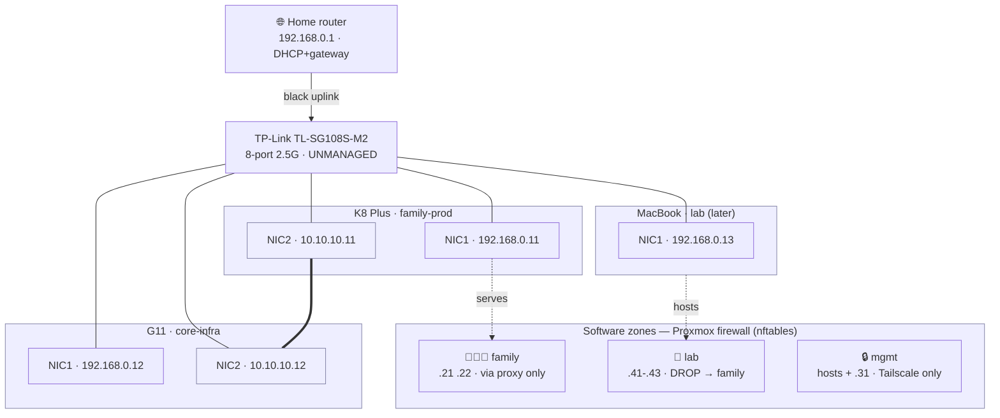

# Network design

Physical: home router → **TP-Link TL-SG108S-M2** (8-port 2.5G, *unmanaged*).
Each mini PC has 2× 2.5G NICs, both to the switch. See ADR-005 for the reasoning.

**Two planes:**
- **192.168.0.0/24 (NIC1):** management, services, internet. The only plane the
  router and family devices see.
- **10.10.10.0/24 (NIC2, no gateway):** Proxmox cluster (corosync ring 0),
  live migration, and PBS backup traffic — kept off the service path.

Config lives in `ansible/roles/proxmox_network/` and is applied by `site.yml`.
