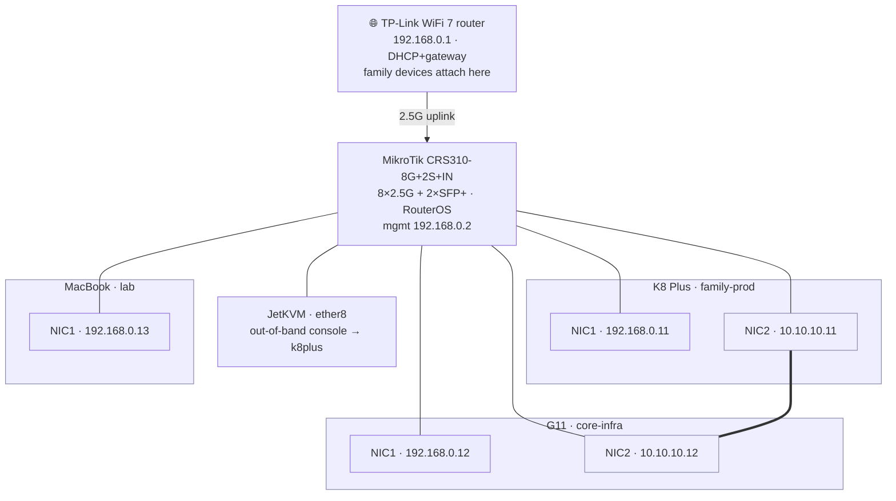

# Network design

Physical: fiber → living-room switch → TP-Link WiFi 7 router (`192.168.0.1`, DHCP +
gateway) → 2.5G port → **MikroTik CRS310-8G+2S+IN** (`192.168.0.2`, RouterOS, managed)
→ homelab nodes.

Family devices hang off the **router** directly, not through the CRS310. The CRS310 is
the homelab's switch, not the house's.

Each mini PC has **2× 2.5G NICs**, both patched to the CRS310. See ADR-005 (why software
zones came first) and ADR-007 (switch-enforced VLANs) for the reasoning.

```mermaid
flowchart TB
    ISP[🌐 TP-Link WiFi 7 router<br/>192.168.0.1 · DHCP+gateway<br/>family devices attach here]
    SW[MikroTik CRS310-8G+2S+IN<br/>8×2.5G + 2×SFP+ · RouterOS<br/>mgmt 192.168.0.2]

    ISP -- 2.5G uplink --> SW

    subgraph K8["K8 Plus · family-prod"]
      K8n1[NIC1 · 192.168.0.11]
      K8n2[NIC2 · 10.10.10.11]
    end
    subgraph G11["G11 · core-infra"]
      G1n1[NIC1 · 192.168.0.12]
      G1n2[NIC2 · 10.10.10.12]
    end
    subgraph MBP["MacBook · lab"]
      Mn1[NIC1 · 192.168.0.13]
    end
    KVM[JetKVM · ether8<br/>out-of-band console → k8plus]

    SW --- K8n1
    SW --- K8n2
    SW --- G1n1
    SW --- G1n2
    SW --- Mn1
    SW --- KVM

    K8n2 === G1n2
    classDef cluster fill:#eef,stroke:#88a;
    class K8n2,G1n2 cluster;
```

## Hardware

| | |
|---|---|
| Model | MikroTik **CRS310-8G+2S+IN** |
| Ports | 8 × 2.5 GbE (RJ45) + 2 × SFP+ (each does 1G / 2.5G / 10G) |
| Silicon | Marvell 98DX226S switch ASIC + dual-core ARM 800 MHz, 256 MB RAM |
| OS | RouterOS v7 |
| Capability | VLANs, LACP, jumbo frames, switch ACLs, **hardware-offloaded L3 routing** |
| Mgmt | `192.168.0.2` · Winbox, and **Winbox-by-MAC** as the lockout lifeline |

**Speed reality check.** Every RJ45 link runs at **2.5 Gbps, full duplex** — 2.5 up *and*
2.5 down, simultaneously. Ports do not add up: two 2.5G NICs on a host give 5 Gbps
*aggregate* but any single transfer still tops out at 2.5. The switch is non-blocking
(8×2.5 + 2×10 = 40 Gbps of ports, and the ASIC keeps up), so the bottleneck is always an
endpoint — in practice the USB HDDs (~1–1.4 Gbps sequential), never the network.

The **SFP+ ports are unused headroom.** Nothing in the fleet has a 10G interface; both
mini PCs are RJ45-2.5G only. They exist for a future NAS, a 10G uplink, or an SFP+→RJ45
module if the router side ever gets faster.

## Port map

| Port | Attached | Status |
|---|---|---|
| ether1 | Uplink → TP-Link router (`192.168.0.1`) | 🟢 |
| ether2–7 | Node NICs: k8plus ×2, g11 ×2, macbook ×1 | 🟢 |
| ether8 | **JetKVM** → out-of-band console for k8plus | 🟢 |
| sfp-sfpplus1/2 | — | unused |

> ⚠️ Exact ether-to-node assignments are **not yet verified against the running config**.
> `ether8` = JetKVM is confirmed; the rest need a pass with
> `/interface/ethernet/print` before this table can be trusted. Until then, treat it as
> intent, not record.

## Two planes

- **`192.168.0.0/24` (NIC1):** management, services, internet. The only plane the router
  and family devices see.
- **`10.10.10.0/24` (NIC2, no gateway):** Proxmox cluster (corosync ring 0), live
  migration, and PBS backup traffic — kept off the service path.

Keeping corosync on its own physical NIC is worth more than bonding the two into a 5 Gbps
LAG: corosync is **latency**-sensitive, not bandwidth-hungry, and it decides whether the
cluster stays quorate. LACP is available on this switch and is deliberately not used.

⚠️ **Never put both NICs of a node on the same subnet** on a flat L2 segment — that causes
ARP flux. NIC2 lives on a different subnet with no gateway.

## VLANs

All three Proxmox nodes already have **VLAN-aware `vmbr0`** bridges, so tagging a guest is
a NIC setting, not bridge surgery.

Migration is **incremental** (ADR-005): infra stays on `192.168.0.0/24`; VLANs are added
only for *new* zones, so a bad switch config cannot take the family offline.

| Phase | Scope | Status |
|---|---|---|
| 0 | Managed switch in, flat `192.168.0.x`, mgmt IP `.2` | ✅ done |
| 1 | VLAN 40 — IoT / Guest (untrusted) | ⏭️ next |
| 2 | VLAN 20 — Lab (K3s tier) | planned |
| 3 | VLAN 30 — Mgmt + cluster, on the second NICs | planned |

Inter-VLAN routing and policy run **on the switch** — hardware-offloaded L3 plus switch
ACLs, not an OPNsense VM and not `/ip firewall filter`. See **ADR-007** for why, and for
the offload rules you must not break.

⚠️ **Lockout risk.** Enabling bridge `vlan-filtering` without the management VLAN in place
first will cut you off from `192.168.0.2`. Lifelines, in order: RouterOS **Safe Mode**
(auto-undo on disconnect) → **Winbox-by-MAC** (works at L2 regardless of IP) → JetKVM
(k8plus console only — *not* the switch).

## Where the config lives

Host-side network config: `ansible/roles/proxmox_network/`, applied by `site.yml`.
Switch-side config is currently **manual via Winbox** — exporting it to a versioned
`/export` file is tracked as follow-up work in ADR-007.
